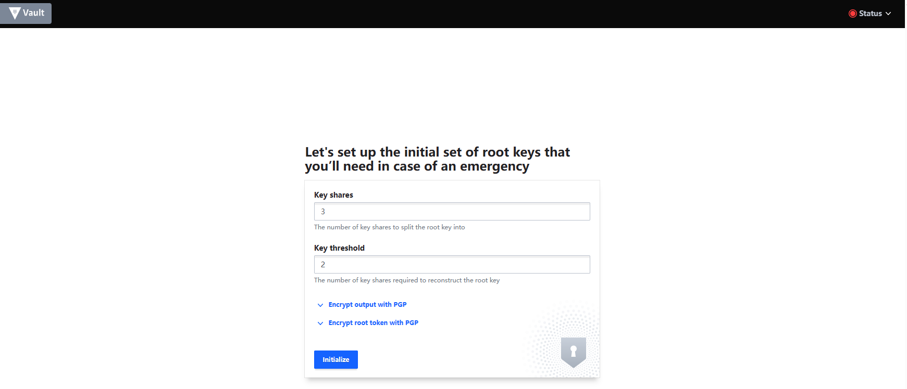
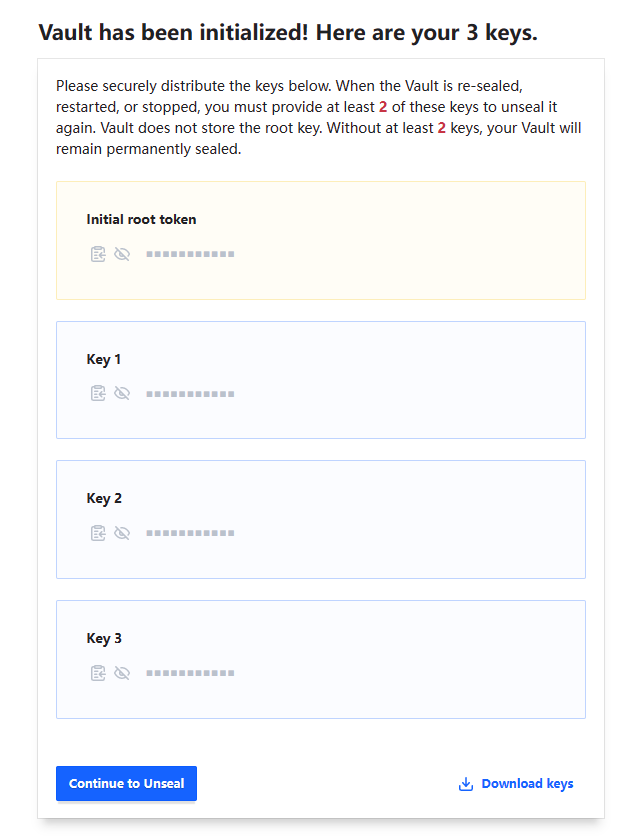
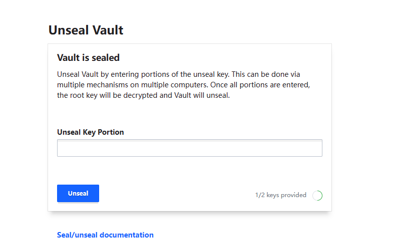
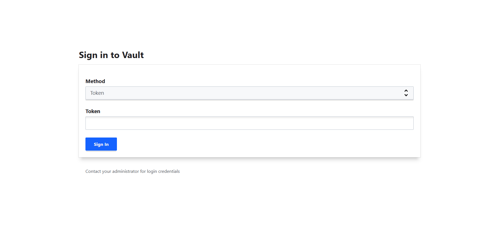

# HashiCorp Vault plugin for Notation

This repository contains the implementation of the HashiCorp Vault signing plugin for [Notation](https://notaryproject.dev/). This project is still in early development status.

> **Note** The Notary Project documentation is available [here](https://notaryproject.dev/docs/). You can also find the Notary Project [README](https://github.com/notaryproject/.github/blob/main/README.md) to learn about the overall Notary Project.

## Quick start

This document demonstrates how to sign and verify an OCI artifact with HashiCorp Vault plugin for Notation. 

## Setup

1. There are two binaries in the release: `key-helper` and `notation-hc-vault`.
2. Install the `notation-hc-vault` plugin to the notation path specified by [notation plugin spec](https://github.com/notaryproject/notaryproject/blob/main/specs/plugin-extensibility.md#installation). On unix, the path is `$XDG_CONFIG_HOME/notation/plugins/hc-vault/notation-hc-vault`.
3. `key-helper` is a standalone helper CLI used to configure Hashicorp Vault.

## Install and Configure Hashicorp Vault Server
1. [Install Hashicorp Vault](https://developer.hashicorp.com/vault/downloads)
2. Create a Vault config file under your work directory. A minimal working example is shown below, more details about config can be found [here](https://developer.hashicorp.com/vault/tutorials/operations/configure-vault#configuration-files):
    ```bash
    $ cat > vault-server.hcl <<EOF
    disable_mlock = true
    ui            = true

    listener "tcp" {
    address     = "127.0.0.1:8200"
    tls_disable = "true"
    }

    storage "raft" {
    path = "/tmp/vault-data"
    }
    EOF
    ```
3. Start a prod server 
    ```bash 
    vault server -config vault-server.hcl
    ```   
4. At this point, open `127.0.0.1:8200` in your browser to see the webpage of your Hashicorp Vault server.
5. Initialize Vault (this is a one-time step, you do not need to do this step in the future). In this example, the root key is split into 3 key shares, and any two keys of the three will be sufficient to unseal Vault, [see details](https://developer.hashicorp.com/vault/docs/concepts/seal).
    
    
    
    > **IMPORTANT** Remember to hit the `Download Keys` button before going forward. Both keys and the initial root token are downloaded. They are required to unseal Vault and sign in.
    
    Unseal Vault <br>
    Enter two of the three keys generated previously to unseal Vault.
    
    
    Sign in <br>
    For test purpose, enter the root token in `Token`
    
    
    By now, the Hashicorp Vault production server is ready to be used.
    
    Note: when Vault process is stopped/closed, Vault will be sealed again.
6. Configure Vault client to talk to your server:
    ```bash
    export VAULT_ADDR='http://127.0.0.1:8200'
    ```
    Set the `VAULT_TOKEN` environment variable value to the downloaded Root Token value.
    ```bash
    export VAULT_TOKEN="hvs.**************"
    ```
    Note: Do not use the root token for production usage of Notation and Vault.
7. If this is your first time setting up Hashicorp vault, you need to enable the Transit Secrets Engine and the KV Secrets Engine. (You could do this in Vault's web UI as well.)
    ```bash
    vault secrets enable transit
    vault secrets enable -path=secret kv-v2
    ```
    (Step 7 is a one-time setup, you do not need this step in the future.)

## Generate Private Key and Certificate Chain
Now you have an empty Hashicorp Vault. Let's put something in it.

A user can bring their own private key and certificate. As a quick start, this tutorial is using openssl to generate a private key and a certificate chain of length 2.
1. Generate CA root certificate
   ```bash
   openssl genrsa -out ca.key 2048
   
   openssl req -new -x509 -days 365 -key ca.key -subj "/O=Notation/CN=Notation Root CA" -out ca.crt -addext "keyUsage=critical,keyCertSign"
   ```
2. Generate private key and leaf certificate
   ```bash
   openssl genrsa -out leaf.key 2048
   
   openssl req -newkey rsa:2048 -nodes -keyout leaf.key -subj "/CN=Notation.leaf" -out leaf.csr
   
   openssl x509 -req -extfile <(printf "basicConstraints=critical,CA:FALSE\nkeyUsage=critical,digitalSignature") -days 365 -in leaf.csr -CA ca.crt -CAkey ca.key -CAcreateserial -out leaf.crt
   ```
   (`leaf.key` is the private key used to sign)
3. Create the certificate chain in a pem file (CA certificate after leaf certificate)
   ```bash
   cat leaf.crt ca.crt > certificate_chain.pem
   ```
4. Import the certificate chain and private key into the Hashicorp Vault using `key-helper`
    ```bash
    ./key-helper import --cert_path "{path-to}/certificate_chain.pem" --key_name "myNotationTestKey" --key_path "{path-to}/leaf.key"
    ```
    `leaf.key` is saved in the Transit Secrets Engine, and `certificate_chain.pem` is saved in the KV Secrets Engine

## Sign an artifact using Notation
Now we've done all the configurations. Let's sign an artifact using Notation. (If you haven't done so, download notation from [here](https://github.com/notaryproject/notation/releases).)
```bash
./notation sign --id "myNotationTestKey" --plugin "hc-vault" <myRegistry>/<myRepo>@<digest>
```
Note: the `--id` should be identical to your `--key_name` in the previous step.

## Verify the artifact using Notation
1. Configure trust store.
    ```bash
    ./notation cert add -t ca -s myStore "{path-to-ca-cert}/ca.crt"
    ```
    where `ca.crt` is the CA root cert generated in the previous step.
2. Confgiure the trust policy.
    ```bash 
    cat <<EOF > ./trustpolicy.json
    {
        "version": "1.0",
        "trustPolicies": [
            {
                "name": "hc-vault-policy",
                "registryScopes": [ "*" ],
                "signatureVerification": {
                    "level" : "strict" 
                },
                "trustStores": [ "ca:myStore" ],
                "trustedIdentities": [
                    "*"
                ]
            }
        ]
    }
    EOF
    ```
    ```bash
    ./notation policy import ./trustpolicy.json
    ```
3. Verify the artifact
    ```bash
    ./notation verify <myRegistry>/<myRepo>@<digest> -v
    ```
